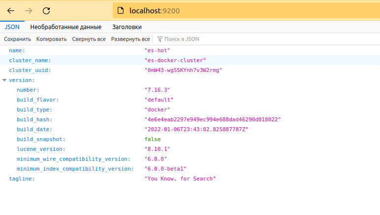

# ELK

## Подготовка. Создание необходимых директорий для ролей. 

```shell
netology@netology:~/Projects/elk/roles$ ansible-galaxy role init elasticsearch
- Role elasticsearch was created successfully
netology@netology:~/Projects/elk/roles$ ansible-galaxy role init kibana
- Role kibana was created successfully
netology@netology:~/Projects/elk/roles$ ansible-galaxy role init logstash
- Role logstash was created successfully
netology@netology:~/Projects/elk/roles$ ansible-galaxy role init filebeat
- Role filebeat was created successfully
netology@netology:~/Projects/elk/roles$ ansible-galaxy role init application
- Role application was created successfully

netology@netology:~/Projects/elk$ sudo sysctl -w vm.max_map_count=262144
[sudo] пароль для netology: 
vm.max_map_count = 262144
```
* `site.yml`:
```yaml
---
- name: Work with elasticsearch-role
  gather_facts: false
  hosts:
    - localhost
  roles:
    - elasticsearch
- name: Work with kibana-role
  gather_facts: false
  hosts:
    - localhost
  roles:
    - kibana
- name: Work with logstash-role
  gather_facts: false
  hosts:
    - localhost
  roles:
    - logstash
- name: Work with filebeat-role
  gather_facts: false
  hosts:
    - localhost
  roles:
    - filebeat
- name: Work with application
  gather_facts: false
  hosts:
    - localhost
  roles:
    - application
```
* Многие задачи с поднятием контейнера либо не содержат `volume's` с файлами конфигурации, либо содержат тома только с указанием директории
* В каждой роли в `templates`-директории можно увидеть, что файлы с конфигурациями были подготовлены. Однако первые попытки запуска контейнера с передачей в томе конкретного файла падали с ошибкой, что `volume` - не директория. 
* Поэтому в `elasticsearch`, `kibana` - используются глобальные переменные, в `logstash` - целая директория с файлами, которые сначала были изучены в ручном запуске контейнера и скопированы на свой хост.
* Истина с работой с `volume` и конкретным файлом открылась мне с `filebeat`: рабочая директория в контейнере, по умолчанию, `/usr/share/filebeat`, где нет отдельных директорий `config`, как в других ролях. Все файлы с настройками и исполняемый лежат в рабочей директории. Передача директории в томе с исполняемым файлом не имела смысла, поэтому пришлось повозиться. А дело оказалось в добавлении `:ro` к `volume` запускаемого контейнера. 
* Но так как было много потрачено времени на успешный запуск всех ролей до этого, изменять такие детали в раннее подготовленных ролях я не стала. 

------------------------------------------------------------------------
### Elasticsearch

* `tasks/main.yml`:

```yaml
---
- name: Create network
  docker_network:
    name: elastic
    appends: yes
    state: present
- name: Pull elastic image
  docker_image:
    name: docker.elastic.co/elasticsearch/elasticsearch:7.16.3
    source: pull
- name: Start es-warm container
  docker_container:
    name: es-warm
    image: docker.elastic.co/elasticsearch/elasticsearch:7.16.3
    state: started
    env:
      cluster.initial_master_nodes: "es-hot,es-warm"
      bootstrap.memory_lock: "true"
      cluster.name: "es-docker-cluster"
      node.name: "es-warm"
      discovery.seed_hosts: "es-hot"
      ES_JAVA_OPTS: "-Xms4g -Xmx4g"
    volumes:
      - data02:/usr/share/elasticsearch/data
    ulimits:
      - memlock:-1:-1
      - nofile:65536:65536
    networks:
      - name: elastic
- name: Add es-warm in inventory
  add_host:
    name: es-warm
    ansible_connection: docker
- name: Start es-hot container
  docker_container:
    name: es-hot
    image: docker.elastic.co/elasticsearch/elasticsearch:7.16.3
    state: started
    env:
      cluster.initial_master_nodes: "es-hot,es-warm"
      bootstrap.memory_lock: "true"
      cluster.name: "es-docker-cluster"
      node.name: "es-hot"
      discovery.seed_hosts: "es-warm"
      ES_JAVA_OPTS: "-Xms4g -Xmx4g"
    volumes:
      - data01:/usr/share/elasticsearch/data
    ulimits:
      - memlock:-1:-1
      - nofile:262144:262144
    ports:
      - 9200:9200
    networks:
      - name: elastic
        links:
          - es-warm
- name: Add es-hot in inventory
  add_host:
    name: es-hot
    ansible_connection: docker
```

------------------------------------------------------------------------
### Kibana

* `tasks/main.yml`:

```yaml
---
- name: Pull kibana image
  docker_image:
    name: docker.elastic.co/kibana/kibana:7.16.3
    source: pull
- name: Start kibana container
  docker_container:
    name: kibana
    image: docker.elastic.co/kibana/kibana:7.16.3
    state: started
    env:
      ELASTICSEARCH_URL: "http://es-hot:9200"
      ELASTICSEARCH_HOSTS: '["http://es-hot:9200","http://es-warm:9200"]'
    ports:
      - 5601:5601
    networks:
      - name: elastic
        links:
          - es-hot
          - es-warm
- name: Add kibana in inventory
  add_host:
    name: kibana
    ansible_connection: docker
```

------------------------------------------------------------------------
### Logstash

* Список передаваемых файлов в томе [тут](roles/logstash/templates/config).
* `tasks/main.yml`:

```yaml
---
- name: Pull logstash image
  docker_image:
    name: docker.elastic.co/logstash/logstash:7.16.3
    source: pull
- name: Start logstash container
  docker_container:
    name: logstash
    image: docker.elastic.co/logstash/logstash:7.16.3
    volumes:
      - /home/netology/Projects/elk/roles/logstash/templates/config/:/usr/share/logstash/config/
    state: started
    ports:
      - 5046:5046
    networks:
      - name: elastic
        links:
          - es-hot
          - es-warm
- name: Add logstash in inventory
  add_host:
    name: logstash
    ansible_connection: docker
```
------------------------------------------------------------------------
### Filebeat

* `templates/filebeat.yml`:
```yaml
filebeat.inputs:
  - type: container
    paths:
      - '/var/lib/docker/containers/*/*.log'

processors:
  - add_docker_metadata:
      host: "unix:///var/run/docker.sock"

  - decode_json_fields:
      fields: ["message"]
      target: "json"
      overwrite_keys: true

output.logstash:
  hosts: ["logstash:5046"]

#output.console:
#  enabled: true

logging.json: true
logging.metrics.enabled: false
```

* `tasks/main.yml`:

```yaml
---
- name: Pull logstash image
  docker_image:
    name: docker.elastic.co/beats/filebeat:8.0.0
    source: pull
- name: Start filebeat container
  docker_container:
    name: filebeat
    image: docker.elastic.co/beats/filebeat:8.0.0
    state: started
    privileged: true
    user: root
    volumes:
      - /home/netology/Projects/elk/roles/filebeat/templates/filebeat.yml:/usr/share/filebeat.yml:ro
      - /var/lib/docker:/var/lib/docker:ro
      - /var/run/docker.sock:/var/run/docker.sock:ro
    networks:
      - name: elastic
        links:
          - logstash
```
------------------------------------------------------------------------
### Application

* `tasks/main.yml`:

```yaml
---
- name: Pull python:3.9-alpine image
  docker_image:
    name: library/python:3.9-alpine
    source: pull
- name: Start application container
  docker_container:
    name: some_app
    image: library/python:3.9-alpine
    state: started
    volumes:
      - /home/netology/Projects/elk/roles/application/templates/run.py:/opt/run.py:ro
    entrypoint: python3 /opt/run.py
- name: Add application in inventory
  add_host:
    name: application
    ansible_connection: docker

```
------------------------------------------------------------------------

## Запуск playbook

```shell
netology@netology:~/Projects/elk$ ansible-playbook site.yml
[WARNING]: provided hosts list is empty, only localhost is available. Note that the implicit localhost does not match 'all'

PLAY [Work with elasticsearch-role] ************************************************************************************************************************************************************

TASK [elasticsearch : Create network] **********************************************************************************************************************************************************
changed: [localhost]

TASK [elasticsearch : Pull elastic image] ******************************************************************************************************************************************************
changed: [localhost]

TASK [elasticsearch : Start es-warm container] *************************************************************************************************************************************************
changed: [localhost]

TASK [elasticsearch : Add es-warm in inventory] ************************************************************************************************************************************************
changed: [localhost]

TASK [elasticsearch : Start es-hot container] **************************************************************************************************************************************************
changed: [localhost]

TASK [elasticsearch : Add es-hot in inventory] *************************************************************************************************************************************************
changed: [localhost]

PLAY [Work with kibana-role] *******************************************************************************************************************************************************************

TASK [kibana : Start kibana container] *********************************************************************************************************************************************************
changed: [localhost]

TASK [kibana : Add kibana in inventory] ********************************************************************************************************************************************************
changed: [localhost]

PLAY [Work with logstash-role] *****************************************************************************************************************************************************************

TASK [logstash : Start logstash container] *****************************************************************************************************************************************************
changed: [localhost]

TASK [logstash : Add logstash in inventory] ****************************************************************************************************************************************************
changed: [localhost]

PLAY [Work with filebeat-role] *****************************************************************************************************************************************************************

TASK [filebeat : Start filebeat container] *****************************************************************************************************************************************************
netology@netology:~/Projects/elk$ ansible-playbook site.yml
[WARNING]: provided hosts list is empty, only localhost is available. Note that the implicit localhost does not match 'all'

PLAY [Work with elasticsearch-role] ************************************************************************************************************************************************************

TASK [elasticsearch : Create network] **********************************************************************************************************************************************************
ok: [localhost]

TASK [elasticsearch : Pull elastic image] ******************************************************************************************************************************************************
ok: [localhost]

TASK [elasticsearch : Start es-warm container] *************************************************************************************************************************************************
changed: [localhost]

TASK [elasticsearch : Add es-warm in inventory] ************************************************************************************************************************************************
changed: [localhost]

TASK [elasticsearch : Start es-hot container] **************************************************************************************************************************************************
changed: [localhost]

TASK [elasticsearch : Add es-hot in inventory] *************************************************************************************************************************************************
changed: [localhost]

PLAY [Work with kibana-role] *******************************************************************************************************************************************************************

TASK [kibana : Pull kibana image] **************************************************************************************************************************************************************
ok: [localhost]

TASK [kibana : Start kibana container] *********************************************************************************************************************************************************
changed: [localhost]

TASK [kibana : Add kibana in inventory] ********************************************************************************************************************************************************
changed: [localhost]

PLAY [Work with logstash-role] *****************************************************************************************************************************************************************

TASK [logstash : Pull logstash image] **********************************************************************************************************************************************************
ok: [localhost]

TASK [logstash : Start logstash container] *****************************************************************************************************************************************************
changed: [localhost]

TASK [logstash : Add logstash in inventory] ****************************************************************************************************************************************************
changed: [localhost]

PLAY [Work with filebeat-role] *****************************************************************************************************************************************************************

TASK [filebeat : Pull logstash image] **********************************************************************************************************************************************************
ok: [localhost]

TASK [filebeat : Start filebeat container] *****************************************************************************************************************************************************
changed: [localhost]

PLAY [Work with application] *******************************************************************************************************************************************************************

TASK [application : Pull python:3.9-alpine image] **********************************************************************************************************************************************
ok: [localhost]

TASK [application : Start application container] ***********************************************************************************************************************************************
[DEPRECATION WARNING]: The command_handling option will change its default value from "compatibility" to "correct" in community.docker 3.0.0. To remove this warning, please specify an 
explicit value for it now. This feature will be removed from community.docker in version 3.0.0. Deprecation warnings can be disabled by setting deprecation_warnings=False in ansible.cfg.
changed: [localhost]

TASK [application : Add application in inventory] **********************************************************************************************************************************************
changed: [localhost]

PLAY RECAP *************************************************************************************************************************************************************************************
localhost                  : ok=17   changed=11   unreachable=0    failed=0    skipped=0    rescued=0    ignored=0   

----------------------------------------------------------------------------------------------

```
* Запущенные контейнеры:

```shell
netology@netology:~$ docker ps
CONTAINER ID   IMAGE                                                  COMMAND                  CREATED          STATUS          PORTS                                        NAMES
2b39a3b06d91   docker.elastic.co/beats/filebeat:8.0.0                 "/usr/bin/tini -- /u…"   21 minutes ago   Up 21 minutes                                                filebeat
52a4e625226b   docker.elastic.co/logstash/logstash:7.16.3             "/usr/local/bin/dock…"   21 minutes ago   Up 21 minutes   5044/tcp, 9600/tcp, 0.0.0.0:5046->5046/tcp   logstash
18d6a8c388e2   docker.elastic.co/kibana/kibana:7.16.3                 "/bin/tini -- /usr/l…"   21 minutes ago   Up 21 minutes   0.0.0.0:5601->5601/tcp                       kibana
6e54809554e7   docker.elastic.co/elasticsearch/elasticsearch:7.16.3   "/bin/tini -- /usr/l…"   21 minutes ago   Up 21 minutes   0.0.0.0:9200->9200/tcp, 9300/tcp             es-hot
75ffdc90ab23   docker.elastic.co/elasticsearch/elasticsearch:7.16.3   "/bin/tini -- /usr/l…"   21 minutes ago   Up 21 minutes   9200/tcp, 9300/tcp                           es-warm
1f8931468048   python:3.9-alpine  
```


* Ответ `elasticsearch`:

```shell
netology@netology:~$ curl -XGET http://localhost:9200
{
  "name" : "es-hot",
  "cluster_name" : "es-docker-cluster",
  "cluster_uuid" : "0mW43-wgSSKYnh7v3W2rmg",
  "version" : {
    "number" : "7.16.3",
    "build_flavor" : "default",
    "build_type" : "docker",
    "build_hash" : "4e6e4eab2297e949ec994e688dad46290d018022",
    "build_date" : "2022-01-06T23:43:02.825887787Z",
    "build_snapshot" : false,
    "lucene_version" : "8.10.1",
    "minimum_wire_compatibility_version" : "6.8.0",
    "minimum_index_compatibility_version" : "6.0.0-beta1"
  },
  "tagline" : "You Know, for Search"
}
netology
```



* `kibana`:

